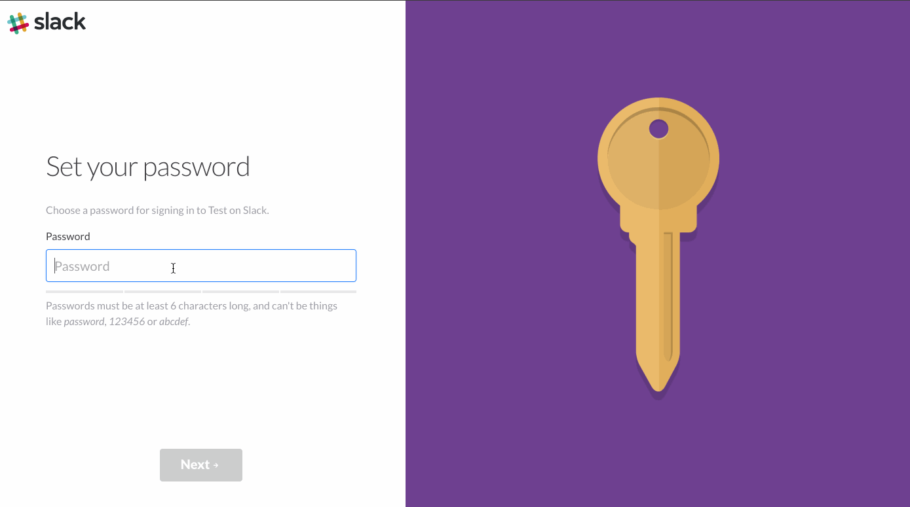
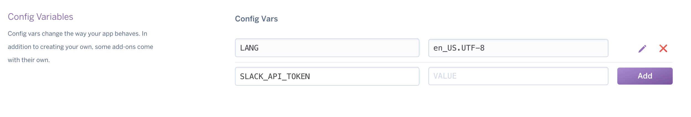

# vetbot
Slack Bot for OperationCode



## Deployment Instructions

### Step 1. Create a Slack Bot

Per instructions [here](https://github.com/slack-ruby/slack-ruby-client#create-a-new-bot-integration):

This is something done in Slack, under [integrations](https://my.slack.com/services). Create a [new bot](https://my.slack.com/services/new/bot), and note its API token.


### Step 2. Save Slack API token to .env file (OPTIONAL: only necessary for development)

Using the API token taken from Step 1, run from root directory of this project:

```
echo SLACK_API_TOKEN="your_token_goes_here" > .env
```

### Step 3. Deploy to Heroku
  [](https://heroku.com/deploy)


### Step 4. Save Slack API token to Heroku

Go to `https://dashboard.heroku.com/apps/<your-heroku-app-name>/settings` and add the `SLACK_API_TOKEN`.



### Step 5. Interact with VetBot!


